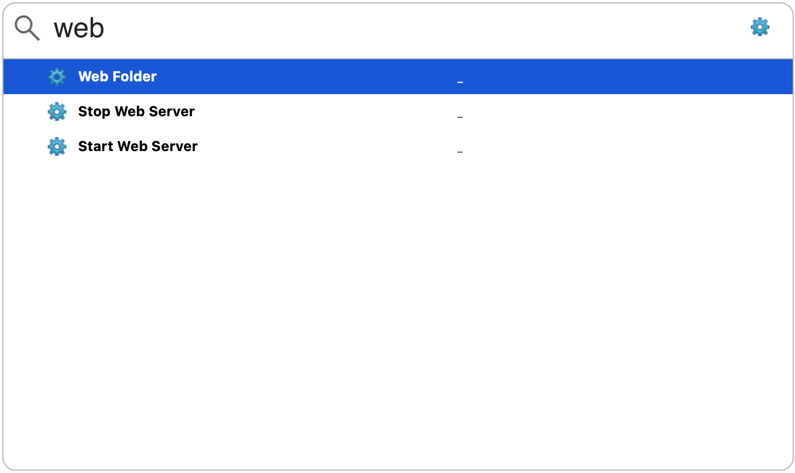
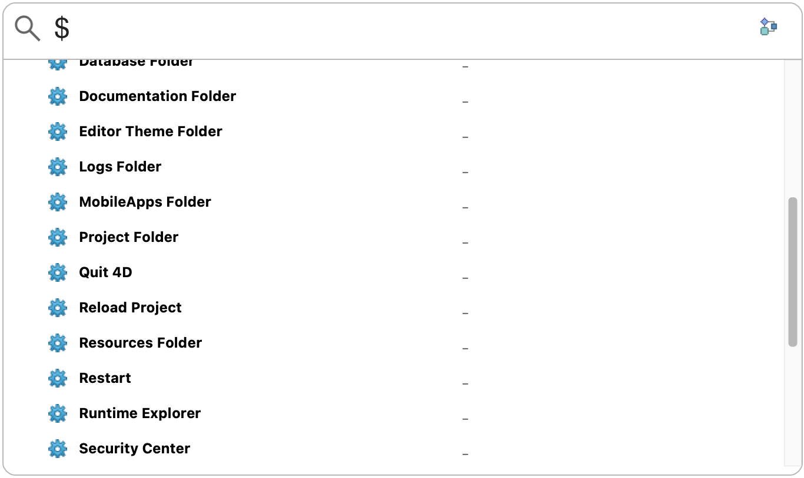

[](https://developer.4d.com/)
[](https://developer.4d.com/)

[](LICENSE)
[](https://github.com/vdelachaux/4DPop-QuickOpen/releases/latest)

# Overview

`4DPop QuickOpen` is entirely inspired by the excellent [`DevQuickOpen`](https://github.com/cannonsmith/DevQuickOpen) shared on Github by [`Cannon Smith`](https://discuss.4d.com/u/smith.cannon/summary). The goal of this reinterpretation is to make it a component and to use to the maximum the new possibilities of the project mode and the language of 4D.

So the description is consistent with that of the inspiration 😉 :

> *(4DPop)* Quick Open is a development tool with the major goal of quickly opening forms, methods, classes, etc. in 4D and is inspired by Xcode's Quickly Open or macOS' Spotlight features. Beyond that, it also handles the creation and opening of documentation and a few smaller things.

The Quick Open window can be opened in two ways:

1. By pressing Option-Space. This means that an event manager must be running (see [Installation](#Installation) below).

2. By clicking on its icon in the 4DPop palette.


# What's new!

Action shortcuts now available. [Select one and 4DPop QuickOpen do the work!](#new)

And more, you can register, very easily, [your own actions](#userActions) from the host database or from a component to run code or display a form!

I strongly encourage you to enrich this project through pull request. This can only benefit the [4D developer community](https://discuss.4d.com/search?q=4D%20for%20iOS). 

`Enjoy the 4th dimension`

# Installation

## A - If you do not use an event-catching method

#### Create, if any, the database method `On startup` and enter this code:

```4D
If (Not(Is compiled mode))
	
	ARRAY TEXT($componentsArray; 0)
	COMPONENT LIST($componentsArray)
	
	If (Find in array($componentsArray; "4DPop QuickOpen")>0)
		
		// Installing quickOpen
		EXECUTE METHOD("quickOpenInit"; *; Formula(MODIFIERS); Formula(KEYCODE))
		ON EVENT CALL("quickOpenEventHandler"; "$quickOpenListener")
		
	End if 
End if
```

> **Note**: This is where you can change the shortcut to invoke the quick search dialog by passing 2 additional parameters to the `quickOpenInit` method (see below: `How to change the main QuickOpen shortcut`)


## B - If you already use an event-catching method

#### 1 - Call the init method before installing your event-catching method. Something like:

```4D
ARRAY TEXT($componentsArray; 0)
COMPONENT LIST($componentsArray)

If (Find in array($componentsArray; "4DPop QuickOpen")>0)
	
	// Installing quickOpen
	EXECUTE METHOD("quickOpenInit"; *; Formula(MODIFIERS); Formula(KEYCODE))
	
End if 

ON EVENT CALL("MY_METHOD"; "$eventHandler")
```
 
#### 2 - Modify your event-catching method like this:

```4D
var $quickOpen : Boolean

// Only in development mode
If (Not(Is compiled mode(*)))
	
	// Only if the component is loaded
	ARRAY TEXT($components; 0)
	COMPONENT LIST($components)
	
	If (Find in array($components; "4DPop QuickOpen")>0)
		
		// Is it a quickOpen call?
		EXECUTE METHOD("quickOpenEventHandler"; $quickOpen)
		
	End if 
End if 

If (Not($quickOpen))
	
	// <THE DATABASE EVENT HANDLER CODE>
	
End if 
```
 
## Restart the database and hit Option-Space in design mode to display the UI

The QuickOpen dialog box should appear

<p align="center"></p>

# Features

> **Note**: These are the same as in the original Cannon development…

* The search starts from 3 characters entered (if "@" is the only character entered, all objects in the project are displayed)
* You can enter for "class" or "form" or "method" to display all objects of this type.
* You can enter a folder name to see all the objects it contains.
* No need for @, the search is a "contains" search.
* A list of entries will appear, sorted by relevance
 
<p align="center"></p>

* You can keep typing or use the up/down arrow keys to select an item to open it.
* You can right-click on an item for additional options (create/edit/delete documentation, show file, edit,…).

<p align="center"></p>
 
* The list will show a paperclip on left for items that have documentation.
* The list shows the name of the object's folder (which is useful for finding the folder of an item if it is misplaced).

# Shortcuts
|||
|:----:|----|
|`⏎` or `⌤`|Open the selected item|
|`⌥ + ⏎`|Open or create the item's documentation|
|`⌥ + ⌫`|Clear the search|
|`Esc`|Close the dialog|

# <a name="new">🆕</a> Quick Actions

Some actions are available such as: Opening a folder, performing a syntax check or starting the web server...

<p align="center"></p>

To explore all actions available, just type a "$"…

<p align="center"></p>

To search only in actions, type "$" followed by keywords.

## Embedded actions

|Names|Actions|Notes|
|----|----|----|
|Active 4D Folder| Opens the Active 4D Folder
|Backup| Launches a backup with the current settings
|Build| Launches the generation process
|Check syntax| Performs a syntax check & diplays the list of errors if any
|Compile| Launch the compilation & diplays the list of errors if any
|Data Folder| Opens the current Data Folder|Local mode only
|Database Folder| Opens the Database Folder
|Documentation Folder| Opens the Documentation Folder| Local mode only
|Editor Theme Folder| Opens the Editor Theme Folder
|Logs Folder| Opens the current Logs Folder
|MobileApps Folder| Opens the MobileApps Folder| Local mode only
|Project Folder| Opens the Project Folder| Local mode only
|Quit 4D| Exits the current 4D application
|Reload Project| Reload the current Project
|Resources Folder| Opens the Project Resources Folder
|Restart| Restarts the current Project
|Runtime exlorer| Displays the Runtime Explorer
|Security Center| Displays the Maintenance and Security Center (MSC) window
|Server Administration| Displays the server administration window|Remote mode only
|Settings Folder| Opens the Settings Folder
|Start Web Server| Starts the web server
|Stop Web Server| Stops the web server
|Structure Settings| Opens the Database Settings dialog box 
|User Settings| Opens the User Database Settings dialog box 
|Web Folder| Opens the Web Folder|If exists

## <a name="userActions">User actions</a>

The shared method ***quickOpenPushAction*** allows you to add your own actions.

The user's actions can be code or a form.

### Code actions

The code to execute is defined by a formula. It can be a simple line or a method call.

```4d
$o:=New object
$o.name:="Test formula"
$o.formula:=Formula(ALERT("hello world"))
quickOpenPushAction($o)
```

```4d
$o:=New object
$o.name:="Test formula"
$o.formula:=Formula(myMethod)
quickOpenPushAction($o)
```
> 📌 Unless you set a "modal" property to true, the code is executed in a new process and provides a default menu bar.

### Form actions

Form actions allow you to directly display a form.
<br/>The form to be displayed must be in a folder located in the `quickAction` folder located in the `Resources` folder of the database.

```4d
$o:=New object
$o.name:="test form"
$o.form:="TEST"
quickOpenPushAction($o)
```
> 📌 The form is displayed in a new process and provides a default menu bar.

# How to change the main QuickOpen shortcut

When you call the `quickOpenInit` method, you can pass 1 or 2 additional parameters: 

* The first is the modifier (default is _`Option key bit`_).
* The second is the character code of the associated key (default is 202 for space).

For example, if you want to install `Cmd-%` as a shortcut:

```4D
EXECUTE METHOD("quickOpenInit"; *; Formula(MODIFIERS); Formula(KEYCODE); Command key bit; Character code("%"))
```
**_WARNING_**: If you install a key combination that gone wrong. You can use the key combination **Ctrl + Shift + Backspace** (on Windows) or **Command + Shift + Control + Backspace** (on Macintosh) to kill the Event Manager process.


